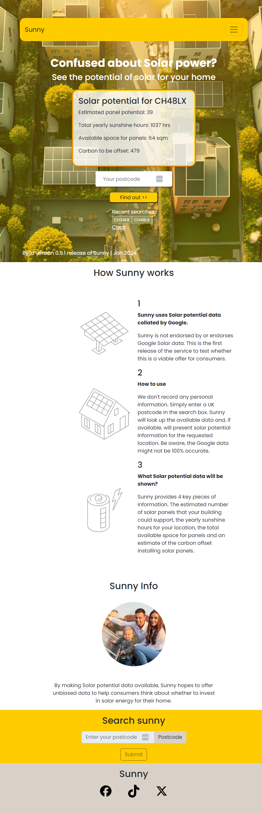

# Sunny

## Introduction
Sunny is a web application designed to provide users with insightful information about solar potential based on geographical locations in the United Kingdom. Users can input their postcode, and the application fetches data to estimate solar panel potential, carbon offset, and other related details.
This project is an exploration of web development, incorporating features like real-time data fetching, dynamic content manipulation, and user-friendly interfaces.

## Features
1. Postcode-Based Solar Information
Users can input their postcode to receive information about solar potential in their area.
The application fetches data such as the estimated number of solar panels, available space for panels, total yearly sunshine hours, and carbon offset.
2. Search History
The app maintains a history of recent searches, allowing users to revisit locations quickly.
Recent searches are displayed as clickable buttons for convenient access.
3. Responsive Design
The user interface is designed to be responsive, ensuring a seamless experience across various devices and screen sizes.
Bootstrap is utilised for a mobile-first design approach.

 ## Technologies Used
- HTML: Markup language used for structuring the web page.
- CSS: Stylesheet language used for designing the app's layout and appearance.
- JavaScript: Programming language used to implement dynamic functionality, fetch solar data, and update the DOM.
- Bootstrap: Front-end framework for responsive and mobile-first design.
- Google Maps API: External API used to retrieve latitude and longitude details based on postcode.
- Solar API: External API used to estimate solar potential based on geographical coordinates.

## Contributing
If you'd like to contribute to the project, please follow these guidelines.
Fork the project:
Create your feature branch: git checkout -b feature/your-feature.
Commit your changes: git commit -m 'Add some feature'.
Push to the branch: git push origin feature/your-feature.
Submit a pull request.

## Contact
For any inquiries or collaboration opportunities, feel free to contact any of the four creators on Github.

## Usage
- Enter the postcode in the designated input field.
- Click on the "Submit" button to fetch solar information.
- View the results, including the estimated number of solar panels, available space, total yearly sunshine hours, and carbon offset.
- Explore the search history for quick access to previously searched postcodes.
Access our very own informative solar energy webpage:
https://johndck.github.io/project1-solarpotential/

## Known Issues
If you encounter issues fetching solar data, ensure your internet connection is stable.

## License
Sunny is open-source and available under the MIT License.